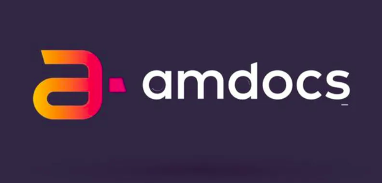
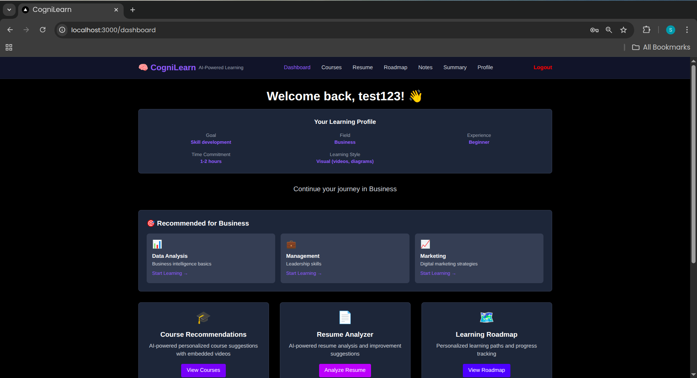
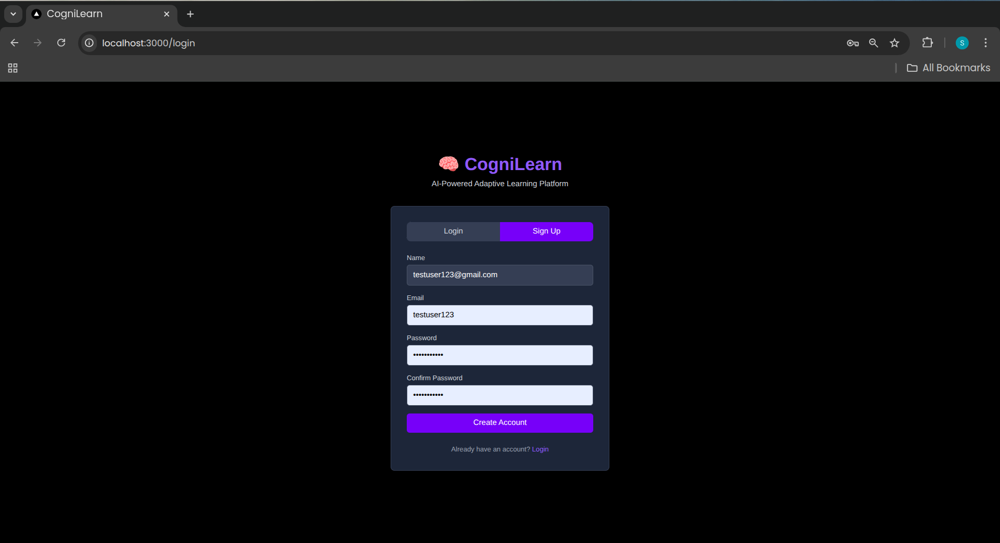
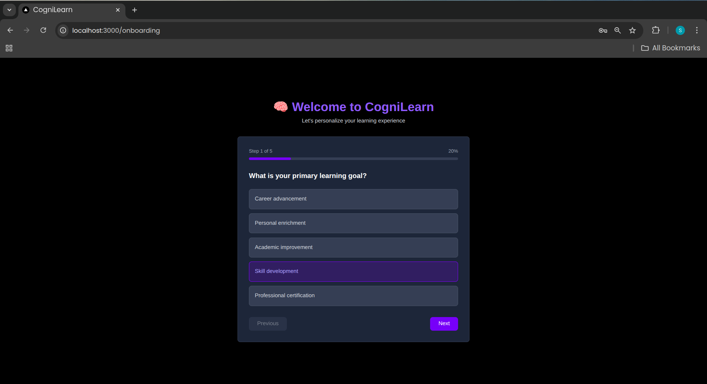
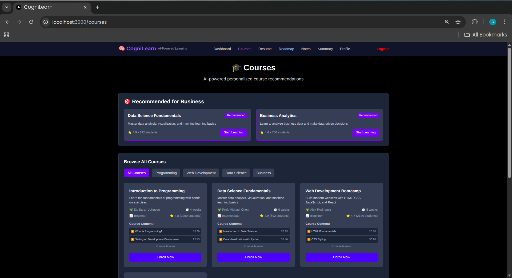
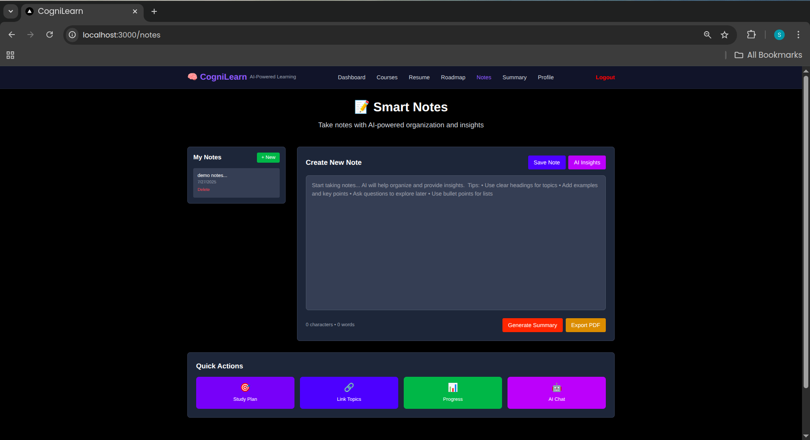
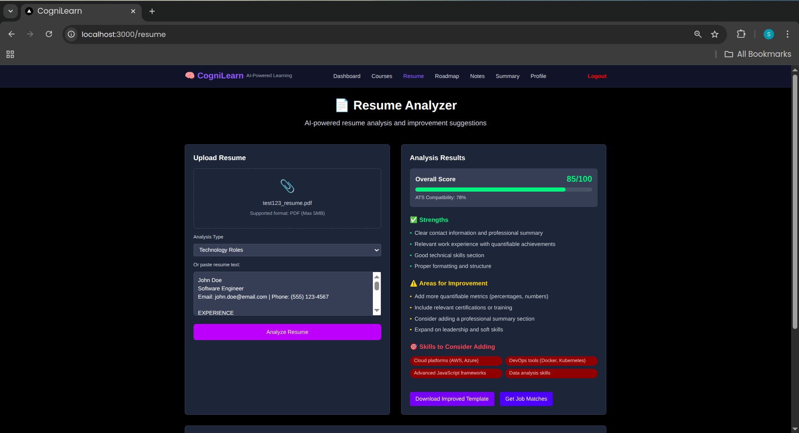
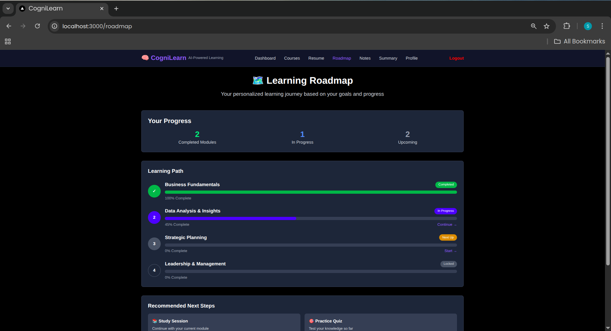
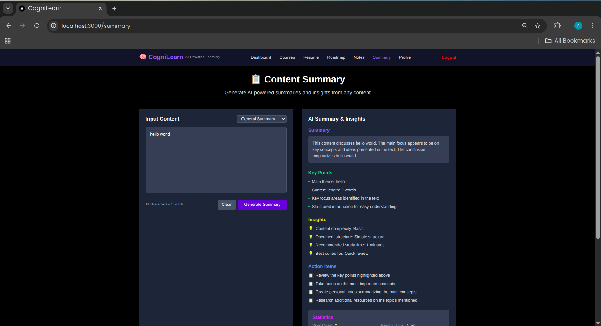
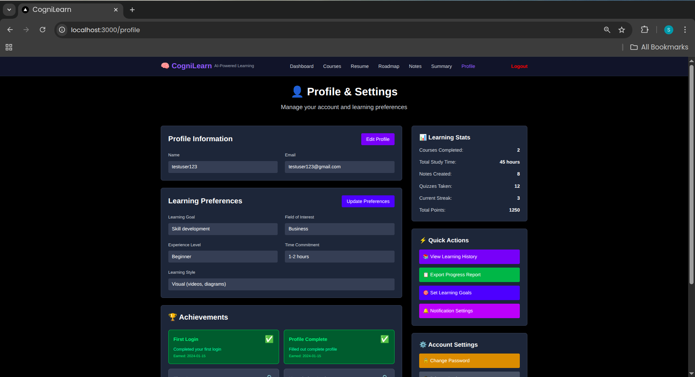

# CogniLearn - AI-Powered Adaptive Learning Platform


*This project was build under Amdocs GenAI Hackathon conducted by Amdocs during Jan 2025 to April 2025, nation wide.*

CogniLearn is an AI-powered adaptive learning platform that personalizes education through intelligent recommendations, quizzes, research analysis, and performance insights.

## 🌟 Key Features

✅ **Course Recommendation System** – AI-driven personalized course suggestions  
✅ **Quiz Generator** – Dynamic quizzes based on difficulty and topic selection  
✅ **Research Paper Analyzer** – Extracts key insights from research papers  
✅ **Performance Analysis Dashboard** – Tracks learning progress and achievements  
✅ **Profile Management** – Detailed user profiles with course history and badges  
✅ **Engaging UI** – Intuitive and visually appealing interface for seamless learning  
✅ **Mentor Recommendation** – AI-powered mentor matching system  
✅ **Adaptive Curriculum** – Intelligent content sequencing based on complexity

## 🏗️ Architecture

```
cogni/
├── frontend/          # Next.js + React + Tailwind CSS
├── backend/           # Node.js + Express + MongoDB
├── ai-services/       # Python AI/ML microservices
└── shared/           # Shared types and utilities
```

## 🚀 Tech Stack

### Frontend
- **Next.js 14** - React framework with App Router
- **React 18** - UI library
- **Tailwind CSS** - Utility-first CSS framework
- **TypeScript** - Type safety
- **Framer Motion** - Animations
- **React Hook Form** - Form handling
- **Zustand** - State management

### Backend
- **Node.js** - Runtime environment
- **Express.js** - Web framework
- **MongoDB** - NoSQL database
- **Mongoose** - MongoDB ODM
- **JWT** - Authentication
- **Socket.io** - Real-time communication
- **Supabase** - Additional backend services

### AI/ML Services
- **Python** - Core language
- **OpenAI API** - LLM integration
- **Sentence Transformers** - Semantic embeddings
- **Scikit-learn** - Machine learning
- **Pandas & NumPy** - Data processing
- **FastAPI** - API framework for AI services

## 🛠️ Setup Instructions

### Prerequisites
- Node.js 18+
- Python 3.8+
- MongoDB
- Git

### 1. Clone and Install

```bash
# Clone the repository
git clone <repository-url>
cd cogni

# Install frontend dependencies
cd frontend
npm install

# Install backend dependencies
cd ../backend
npm install

# Install AI services dependencies
cd ../ai-services
pip install -r requirements.txt
```

### 2. Environment Variables

Create `.env.local` files in both frontend and backend directories:

**Frontend (.env.local):**
```env
NEXT_PUBLIC_API_URL=http://localhost:3001
NEXT_PUBLIC_SUPABASE_URL=your_supabase_url
NEXT_PUBLIC_SUPABASE_ANON_KEY=your_supabase_anon_key
```

**Backend (.env):**
```env
PORT=3001
MONGODB_URI=mongodb://localhost:27017/cognilearn
JWT_SECRET=your_jwt_secret
OPENAI_API_KEY=your_openai_api_key
NVIDIA_API_KEY=your_nvidia_api_key
SUPABASE_URL=your_supabase_url
SUPABASE_SERVICE_KEY=your_supabase_service_key
```

**AI Services (.env):**
```env
NVIDIA_API_KEY=your_nvidia_api_key
OPENAI_API_KEY=your_openai_api_key
```

### 3. Start Development Servers

```bash
# Terminal 1: Start MongoDB
mongod

# Terminal 2: Start AI Services
cd ai-services
python main.py

# Terminal 3: Start Backend
cd backend
npm run dev

# Terminal 4: Start Frontend
cd frontend
npm run dev
```

Visit `http://localhost:3000` to see the application.

## � Application Screenshots

The `images/` folder contains comprehensive screenshots showcasing all the key features and interfaces of CogniLearn:

### 🏠 Homepage & Dashboard

*Homepage and main dashboard overview showing learning progress and recommendations*

### 🔐 Authentication

*Secure login and registration interface with modern design*

### 🎯 User Onboarding

*Personalized onboarding flow for customized learning setup*

### 📚 Course Catalog

*AI-powered course recommendations with filtering and enrollment options*

### 📝 Note-Taking System

*Advanced note-taking with AI insights and intelligent organization*

### 📄 Resume Analyzer

*AI-powered resume analysis with ATS scoring and improvement suggestions*

### 🗺️ Learning Roadmap

*Personalized learning paths with milestone tracking and progress visualization*

### 📊 Content Summary

*AI-powered content summarization and analysis tool*

### 👤 Profile & Settings

*Comprehensive profile management with preferences and achievement tracking*

These screenshots demonstrate the platform's intuitive design, comprehensive feature set, and modern user interface that makes learning engaging and effective.

## �🔗 API Endpoints

### Authentication
- `POST /api/auth/register` - User registration
- `POST /api/auth/login` - User login
- `GET /api/auth/profile` - Get user profile

### Courses
- `GET /api/courses` - Get all courses
- `GET /api/courses/:id` - Get course by ID
- `POST /api/courses/recommend` - Get AI recommendations

### Quizzes
- `GET /api/quizzes` - Get all quizzes
- `POST /api/quizzes/generate` - Generate AI quiz
- `POST /api/quizzes/submit` - Submit quiz answers

### Research
- `POST /api/research/analyze` - Analyze research paper
- `GET /api/research/history` - Get analysis history

### Performance
- `GET /api/performance/dashboard` - Get performance metrics
- `GET /api/performance/progress` - Get learning progress

## 👥 Team Members
- Sameer Dhande

- Soham Yedgaonkar

---
